# **Observations on Microenvironment Microarrays**

### Daniel Zou, Judy Wu, Liza Kostina

---

*Date: September 18, 2024*


## Introduction


In this project, our primary focus is to conduct an exploratory data analysis on data related to the cellular microenvironment. A cell's microenvironment is the immediate collection of extracellular matrix proteins, growth factors, chemokines, cytokines, and other structures surrounding cells within a tissue. These elements include both structural components, such as collagen, and biochemical or signaling molecules.

While we are not approaching this project from a deeply biological perspective, our aim is to analyze the provided data to uncover potential insights. We are focused on identifying patterns and trends within the data that could contribute to understanding the role of the microenvironment in cancer cell growth. Even more importantly, we investigate whether these patterns and trends are due to microenvironment or the experimental procedure itself. Specifically, we examine issues with missing data, spatial correlation within wells, disparity between staining sets, and analyze control wells. The ultimate goal is to offer valuable insights into the data, experimental methodology, and possibly the science behind the data itself.


## Missing Data

Our team began the analysis by investigating the missing values in the dataset. This is an essential step because missing data can significantly impact the conclusions we draw from the analysis. In some cases, missing values can distort statistical results or lead to biased interpretations if not handled properly. Therefore, understanding the nature and extent of missing data is crucial before proceeding with any further analysis.

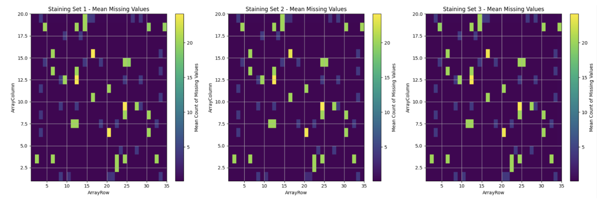


The chart (Figure 1) displayed here shows a comparison of missing values across three different staining sets. The overall distribution of missing values within plates across staining sets appears consistent, which is a positive outcome. This suggests that any subsequent analysis should not be disproportionately affected by missing data discrepancies between staining sets. However, we observed that each staining set contains plates with unique features that are consistent within that set but may not be present in others. Additionally, the number of features with missing values varies across the staining sets. Notably, there are features with 100\% missing values across all plates: ```750nmLx```, ```Drug1Lx```, ```ECM3```, ```Drug1ConcUnit```, ```Drug1An```, ```Drug1```, ```750nm```, ```Endpoint750```, ```Drug1TimeUnit```, ```Drug```, ```Drug1TimeReact```, which may indicate potential issues with the experimental design. These columns were excluded from further analysis as they provide no valuable information. Additionally, Staining Set 2 has 3 columns with 100\% missing values, which fortunately have constant values in other staining sets, so they can also be ignored in the analysis.
This finding prompted us to further analyze the missing data patterns across plates and staining sets to identify any underlying trends or anomalies.


We continued our analysis by investigating potential reasons for the observed missing values. After calculating the percentage of missing data for each well and each plate, we found consistent results across all features except one: ```Ligand1Lx```. This feature stood out due to its unique pattern of missing values, which appeared in only one plate per staining set.

Our investigation revealed that the missing values for ```Ligand1Lx``` were specifically associated with ```WellIndex = 2``` across all plates. No other wells exhibited missing values for this feature, indicating a localized issue. Interestingly, the positions of these missing values were identical across all plates, suggesting a consistent pattern rather than random occurrence.

This finding is notable because, while most features and wells showed a uniform distribution of missing values, ```Ligand1Lx``` followed a different trend. We also identified another feature, ```ECM1Lx```, which had distinct missing value positions compared to the remaining features. Additionally, features such as ```ECM```, ```ECM2An```, ```ECM2ConcUnit```, ```ECM2Lx```, and ```ECM2Conc``` exhibited missing values in the exact same positions as the ```ECMp``` feature when the value of ```ECMp``` was ```COL1```. 

The left plot (Figure 2) shows the positions of missing values (red crosses) for the features ```ECM```, ```ECM2An```, ```ECM2ConcUnit```, ```ECM2Lx```, and ```ECM2Conc```. The right plot visualizes the positions of the ```COL1``` value for the ```ECMp``` feature (blue dots). As we can see, there is a 1-to-1 correspondence between the positions of the missing values on the left plot and the positions of ```COL1``` on the right plot. This indicates a strong relationship between the missing data in these features and the specific value of ```COL1``` in the ```ECMp``` feature, suggesting that ```COL1``` is likely driving the missingness in these features.


This suggests a possible relationship between the extracellular matrix (ECM) and the missing data in our dataset, particularly linked to the ```COL1``` value. This finding hints at an underlying cause related to the ```COL1``` condition, which may be influencing data availability at these positions.

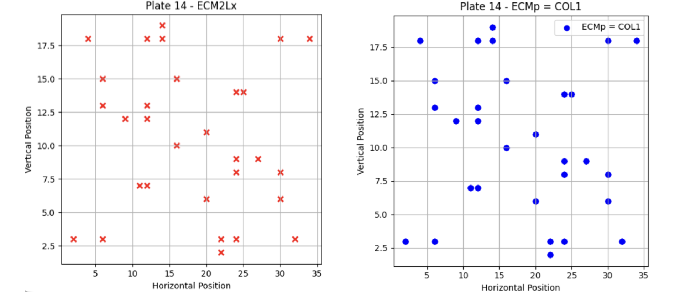

After identifying the two main reasons for missing data (```ECMp = COL1``` and ```WellIndex = 2``` for ```Ligand1Lx```), we turned our attention to the features that are common across all plates.

## Spatial Correlation

In scientific experiments involving cell culture, spatial factors can often play an unintentional yet critical role in influencing outcomes. In this experiment, Extracellular Matrix Proteins (ECMPs) were randomly distributed across wells. Ideally, such randomization should prevent spot location from influencing the experiment's outcome, allowing us to focus purely on biological repsonses to ECMPs. The goal of this section was to investigate whether spatial coherence could be detected across the wells and whether a correlation exists between neighboring spots. 

### Spatial Distribution of Nuclei Area and Cell Count

We first investigated whether relationship between spot locations and key features nuclei area (```Nuclei_CP_AreaShape_Area```) and spot cell count (```Spot_PA_SpotCellCount```) can be detected within wells. We used Kernel Density Estimation (KDE) plots to visualize the distribution of these features across spot locations in individual wells and also compared results across multiple plates and staining sets. 

Our first focus was on the distribution of nuclei area within wells. Contrary to the expectation that random ECMP placement should lead to a uniform distribution of phenotypical changes, a clear pattern emerged. 

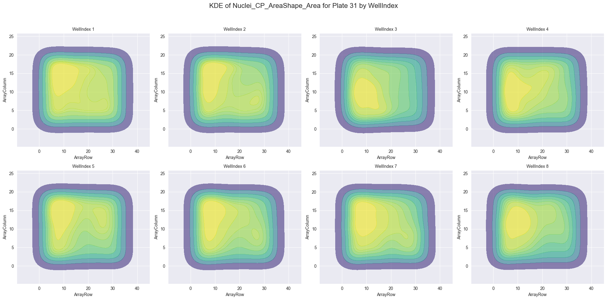

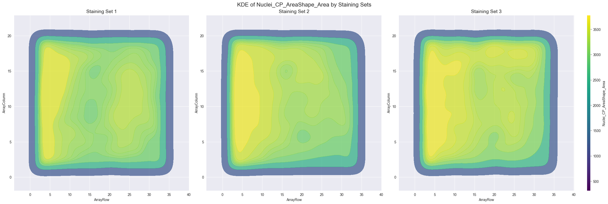

As an example, Figure 3 shows how nuclei area varied based on spot location in each well in Plate 31. One can observe that nuclei areas on the left side of the wells were consistently larger compared to other regions within the same well. This trend was not isolated to Plate 31. Expanding the analysis to all plates and staining sets, similar spatial patterns were observed. Figure 4 reveals that this spatial pattern is consistent across plates in all three staining sets. The persistence of the spatial pattern suggests that spot location rather than purely random factors, may be influencing the observed outcomes

We also explored cell count distribution across spot locations. Looking at Figure 5, the KDE plot generated from Staining Set 2 Plate 30, we observe spatial coherence, with significantly higher cell counts found in the left side of most of the wells. This pattern mirrored what was seen in nuclei area distribution. And when examining Plate 13 from Staining Set 3 (Figure 6), one can observe that higher cell counts were concentrated in the bottom-right regions of the wells. Figure 4 shows the spot cell count distribution across staining sets, which indicates that the similar pattern was consistent across multiple plates within staining set 2 and 3. Despite the difference in exact location, this evidence of spatial coherence across wells and staining sets suggests that the random configuration of ECMP spots is not completely eliminating location-based effects.

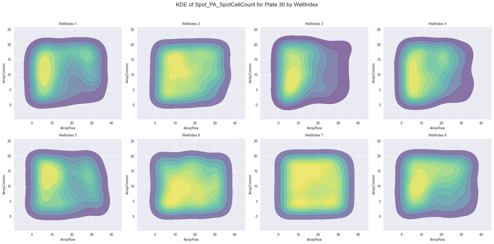

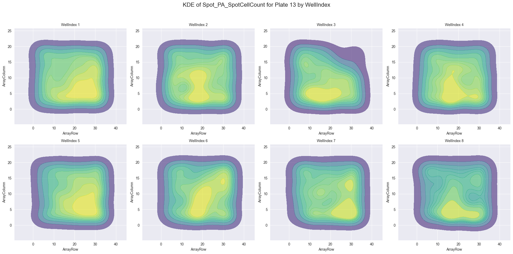

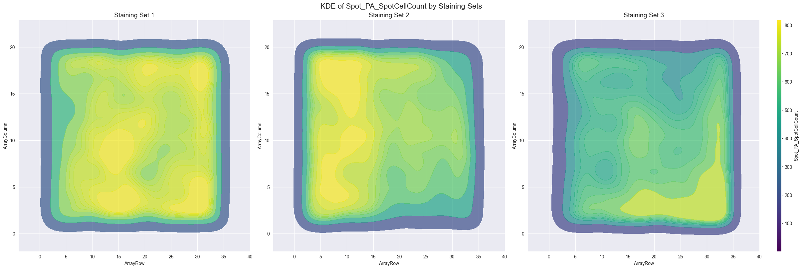

### Spot-to-Spot Correlation

In addition to spatial coherence within wells, we also sought to determine whether a correlation exists between neighboring spots. Specifically, we looked at the difference between the average cell count of neighboring spots and the overall well average. Figure 8 shows the cell count difference in Plate 30 Well 2. It reveals that certain ECMPs displayed greater differences in neighboring spot counts compared to others, indicating a possible spot-to-spot correlation.

However, the fixed configuration of ECMP spots across wells limits our ability to conclude the significance of this correlation. Given that the same spatial layout is used repeatedly, each spot has fixed neighbors. It is difficult to determine whether the observed differences across ECMP types are truly due to interaction between neighboring spots or simply a byproduct of the experimental setup. To conclusively assess the presence of spot-to-spot correlation, further randomization in spot configuration is necessary.

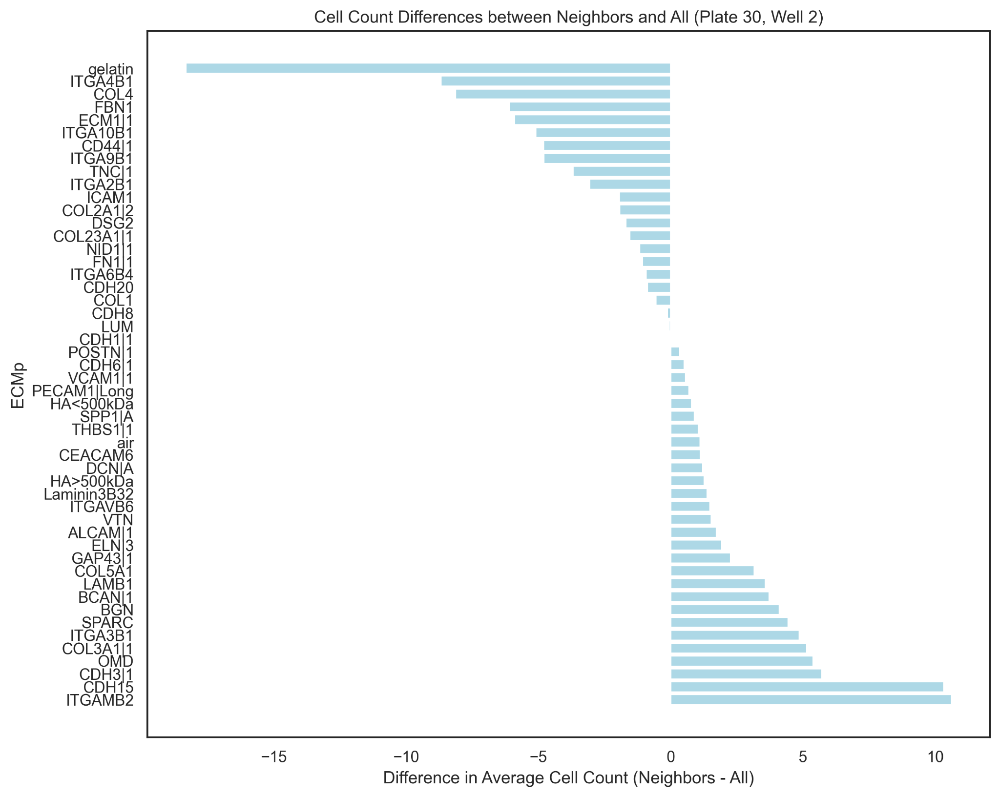

### Possible Challenges Posed by Spatial Correlation

These findings can raise several important concerns for future analysis, particularly regarding the role of spot location as a potential confounding variable. 

Since the study revealed that spot location may influence the outcome,  systematic biases may be introduced to the experimental results. This could complicate statistical analysis, leading to false conclusion about the biological effect of ECMPs or ligands. Moreover, the spatial effects can pose a challenge to biological interpretation. Since spot location appears to influence phenotypical changes, researchers must question whether the observed results are a direct response to the ECMPs and ligands being tested or simply an artifact of the experimental design.

The potential spot-to-spot correlation we identified introduces another layer of complexity. If neighboring spots are influencing one another, it may become difficult to attribute changes in cellular features to specific ECMPs. The fixed  configuration of spots further compounds this issue, as it makes it harder to recognize and control for spot interaction.

### Recommendation for Future Experiments

In light of these findings, adjustments to the experimental designs are recommended to reduce spatial biases. 

We first recommend to revisit the randomization process for ECMP placement to ensure that no unintended spatial biases are introduced. If  randomization alone does not resolve the issues, we recommend to introduce spatial controls to future run of experiments and analysis. For example, controlling edge effect or stratifying data based on well regions may provide more accurate insights. For the issue of spot-to-spot correlation, we recommend you to increase the distance between spots to limit the interaction between neighboring spots, which can allow for a clearer assessment of each spot's individual effect.


## Disparity Between Staining Sets

Staining is a crucial step in enhancing contrast and allowing for better observation of phenotypical changes in the samples. However, it is essential to our experimental outcomes that the staining process itself does not introduce any significant changes in cell behavior. The concern addressed here is the potential disparity between different staining sets, which could affect the integrity of the analysis. We investigate this disparity through looking at two main variables of interest, the Nuclei Area and the Cell Count.

We first examine a histogram of the nuclei area, split across different staining sets, presented in Figure 9. The overlaid histograms compare the probability density of nuclei area for different staining sets. We can see that the distributions for nuclei area are quite distinct, with different means and different variances. This distinction is not unique to the nuclei area. Considering similar overlaid histograms for cell count, another variable of interest, in Figure 10, we still see the probability distributions are different for each staining sets. Additional to the different means and variances, we also see different shapes for the staining sets. Staining Set 3, colored in red, is bimodal with a right skew, while the other staining sets are unimodal with a left skew. From these figures, we can see that the probability distributions for outcome variables can be completely different based on staining set, for mean, variance, as well as shape.

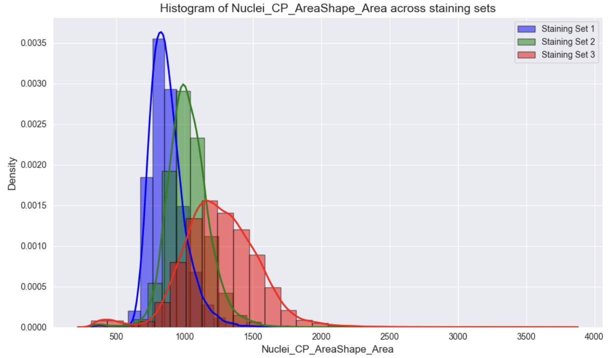

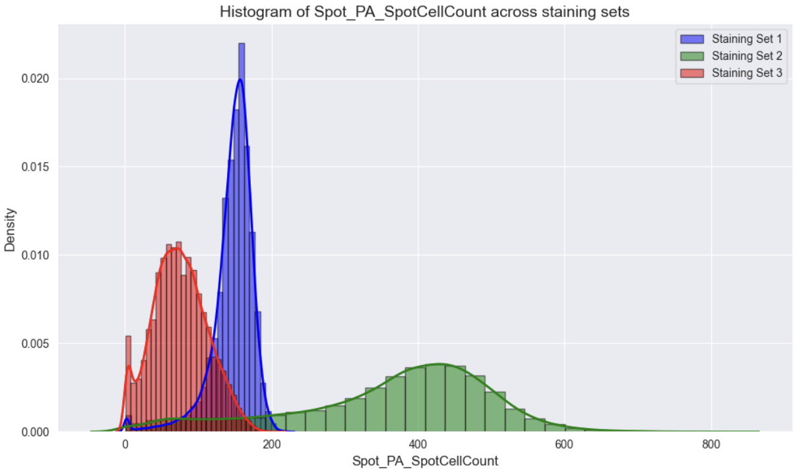

These disparities in the probability density for key outcome variables suggest that the staining process does impact these variables, and provides significant challenges to our data analysis. These disparities make it problematic to combine the data into a single dataset, as doing so might introduce bias and distort the results. Conversely, splitting the datasets by staining sets might resolve this issue but would significantly reduce the sample size, making statistical analysis more difficult. Furthermore, if staining is affecting the results, it becomes challenging to isolate the effects of ligands and ECMPs on phenotypical changes, especially when using stains like DAPI that is in every staining set. This situation could be exacerbated by potential interaction effects between staining and other experimental variables.

To address these challenges, it is essential to first identify the source of the disparity. If the variation is due to the staining process itself, the data from different staining sets should not be combined, but we are able to analyze the staining sets separately. In this case, increasing the number of experimental runs might be necessary to compensate for the reduced sample size. Alternatively, if procedural differences, such as increased analysis time for some staining sets, are causing the disparity, normalization methods could be applied, though caution is needed, as shape-related differences might still pose a problem. 

Another way to simplify the analysis would be to eliminate unnecessary stains. If certain stains are not critical to the research objectives, they can and should be removed. For those that are essential, running additional experiments without that specific stain and comparing other measurable effects can hopefully determine whether that stain can cause phenotypical changes. By removing or limiting the effect of stains in future runs, we will receive data that is more amenable to analysis of phenotypical changes.

## Analysis of Control Wells

Control wells are a critical aspect of any experimental setup, providing a baseline against which the effects of treatments can be compared. In this section, we consider all non-control ligands as treatment. In this study, a control well is included on each plate, with consistent ligand and ECMP combinations. This allows us to do additional analysis on plate-to-plate and stain-to-stain differences. The analysis of these control wells helps identify potential experimental artifacts, such as spurious correlations that may arise from different staining sets or plates. Additionally, comparing phenotypical changes within the control wells can reveal variability, which might indicate issues with experimental consistency. 

### Spurious Correlation

In this section, we look at plate related spurious correlation. In Figure 11, we have side-by-side scatterplots for mean control cell counts and mean treatment cell counts for each plate. We split by staining set since we already know there are significant disparities between staining sets. Even after splitting, we find that there are clear positive correlations between the control and treatment cell counts for all three staining sets, even though there are only eight plates per staining set.

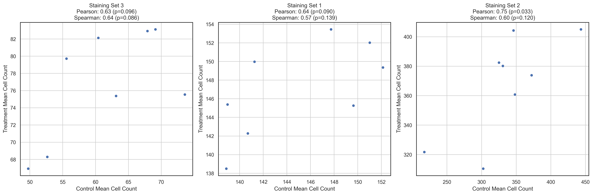

This correlation between the control and treatment plates in terms of cell counts suggests that there are significant plate-wise differences. This might be caused by environmental factors such as a plate being in a warmer environment than other plates, or experimental factors such as a some plates being analyzed later leading to more time for cell growth.

### Variability between Control Wells

We also examine the variability between control wells in the same staining set. These control wells have the same ligand, ECMP, and staining combo, so we would expect the variability between these wells to be quite small, or at least small enough for our treatments to be significant. On the left of Figure 12, we see a boxplot comparing the distributions of cell counts for the control wells across the plates of Staining Set 2, focused on a single ECMP (VTN) to further reduce variability in our analysis. This graph shows us the variability in cell count across control wells in a single staining set. On the right, we have a boxplot for cell counts per ligand in a single plate in Staining Set 2, also focused on the same ECMP. This graph would show the variability in cell count across different ligands in the same plate. From the side-by-side plots, we can see that the variability on the left is higher, which means that the variability due to the plate can be larger than the variability due to the ligand.

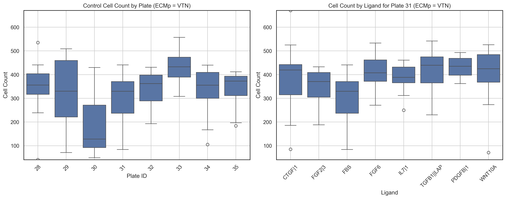

### Possible Challenges and Future Work

This leads to many challenges for analysis on this dataset. The correlation due to plate prevents us from comparing phenotypical changes for ligands on different plates, as those changes can be correlated to plate. Also, if we are comparing ligand-ECMP combinations, this spurious correlation also affects our analysis for ECMPs. Furthermore, significant variability within control wells of the same staining set has been observed, raising concerns about the overall quality and reproducibility of the experimental process.

To address these concerns, it is recommended to keep experimental conditions as consistent as possible across all plates. Consistency helps reduce variability and ensures more reliable comparisons. However, if it is not feasible to maintain consistent conditions across plates, other strategies can be employed. To reduce bias from the process, multiple randomizations of ligands across different plates could help disentangle the effects of ligands from plate-specific biases. 

Alternatively, trying to keep analysis on a single plate could be another solution. One way to do so is focusing on a smaller set of key ligands that could fit on a single plate. Another option is to use larger plates to fit more ligands. By addressing these challenges, researchers can improve the reliability and interpretability of the experimental data.

## Conclusion

This project provided valuable insights into the complexities of analyzing microenvironment microarrays, particularly in understanding how missing data, spatial correlations, and disparities between staining sets affect experimental outcomes. We began by investigating missing values and discovered that their occurrence is strongly associated with specific ECMPs and ligands, revealing a potential link between data collection quality and the input variables. Next, the analysis of spatial correlation showed that the randomization of ECMP spots did not fully eliminate location-based effects, with significant spatial coherence influencing phenotypical outcomes across wells. This finding suggests the need for experimental adjustments to reduce these biases in future studies. Furthermore, our investigation into the disparity between staining sets revealed significant differences in phenotypical changes, such as nuclei area and cell count, which posed challenges for combining data across sets. This highlighted the importance of identifying whether staining or procedural variations are causing these discrepancies. Finally, the analysis of control wells showed variability across plates and staining sets, indicating potential experimental artifacts that could hinder accurate interpretation of treatment effects. Addressing these challenges through consistency in experimental conditions or the use of multiple randomizations will be key to improving the reliability of future experiments.

In conclusion, while the project successfully identified key issues impacting the analysis, it also provided a roadmap for refining experimental design to mitigate these challenges in future work.


## Appendix

All computational results, including Jupyter notebooks, images, and Markdown files, can be found in the project's GitHub repository.

You can access the repository here: [Observations on Microenvironment Microarrays](https://github.com/lzkostina/Observations-on-Microenvironment-Microarrays)
